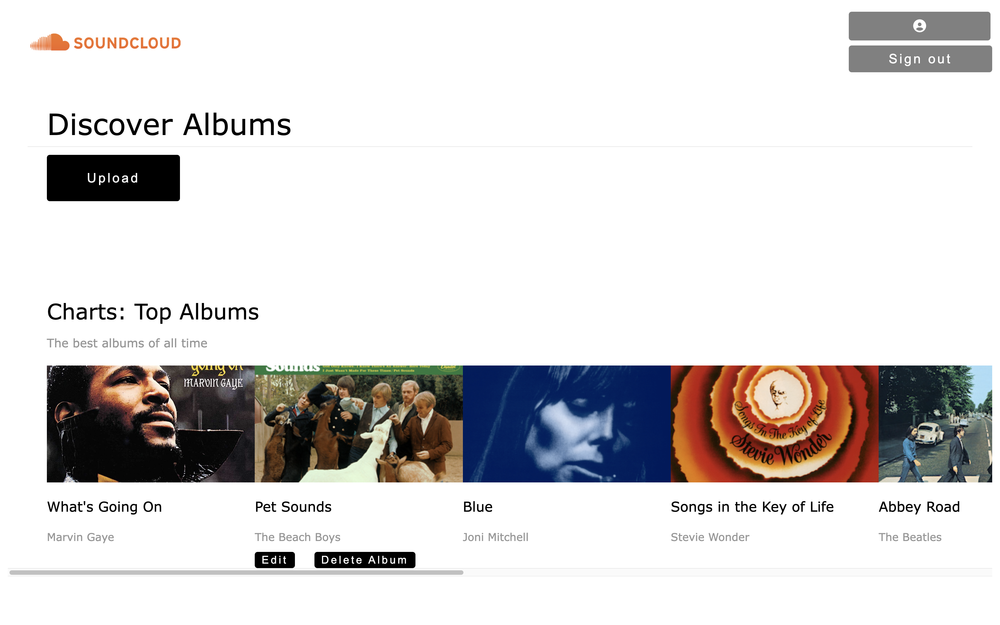
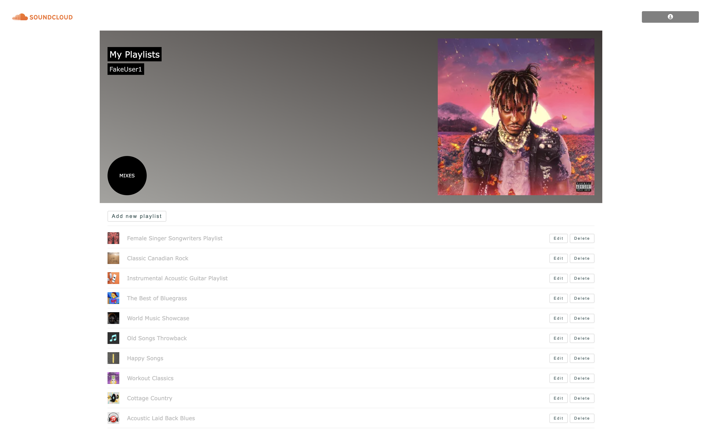

# `SoundCloud Project`

## Technologies

- Sequelize/Express
- React/Redux

## Quick Links

- [Database Schema](https://github.com/KellyAnneSantos/SoundCloud/blob/main/backend/README.md#database-schema-design)
- [API Documentation](https://github.com/KellyAnneSantos/SoundCloud/blob/main/backend/README.md#api-documentation)
- [Live Site](https://app-name-soundcloud.herokuapp.com/)

## About

This project is a web application inspired by the website SoundCloud. Currently, the project includes two CRUD features: albums and playlists. Before signing in, the user can only READ albums and must pass authentication in order to interact with the rest of the features. The application offers a demo user login for ease of use.

## Albums Screenshot



## Playlists Screenshot



## Setup

1. Clone the project
2. Create a .env file as below:

```
PORT=8000
DB_FILE=db/dev.db
JWT_SECRET=«generate_strong_secret_here»
JWT_EXPIRES_IN=604800
```

3. Run "npm install" in the root directory, back end and front end folders
4. Run "npx sequelize db:migrate" in the back end folder
5. Run "npx sequelize db:seed:all" in the back end folder
6. Run "npm start" in the back end terminal
7. Run "npm start" in the front end terminal

## Future Features

- [ ] Song CRUD operations
- [ ] Comment CRUD operations
- [ ] Search bar
- [ ] Audio
